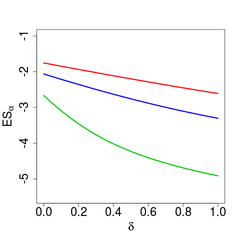

[](http://quantlet.de/index.php?p=info)

## [](http://quantlet.de/) **TERES_ES_Analytical** [](http://quantlet.de/d3/ia)

```yaml

Name of QuantLet : TERES_ES_Analytical

Published in : Tail Event Risk Expected Shortfall

Description : 'Estimates the theoretical expected shortfall of a sample for a normal Laplace
mixture. This is done using a expectile based method. The calculation requires a expectile level
such that it is equal to the value at risk with the predetermined risk level. This and the relevant
quantile are obtained from a normal Laplace mixture.'

Keywords : 'expected shortfall, expectile, financial, heavy-tailed, laplace, normal, risk, risk
management, risk measure, tail'

See also : 'MSEconfexpectile0.95, SFSconfexpectile0.95, SFSconfexpectile0.95,
TERES_ExpectileQuantileDiffMulti'

Author : Philipp Gschöpf, Andrija Mihoci

Submitted : Tue, August 2 2016 by Roman Lykhnenko

```




### R Code:
```r
# Load required packages
library("VGAM")
library("BMS")
library("expectreg")
library("fGarch")
library("numDeriv")
library("rootSolve")

Contamination = 0
RiskLevel = 0.01

tauexact = function(alpha, delta = 0) {
  if (alpha < 1e-27) {
    return(0)
  }
  F = function(x) {
    (1 - delta) * pnorm(x) + delta * plaplace(x)
  }
  f = function(x) {
    grad(F, x)
  }
  inverse = function(f, lower = -100, upper = 100) {
    function(y) uniroot((function(x) f(x) - y), lower = lower, upper = upper)[1]
  }
  quantileFun = inverse(F)
  q = as.numeric(quantileFun(alpha))
  LPM = function(x) {
    x * (f(x))
  }
  LPMq = function(x) {
    integrate(LPM, -Inf, x)
  }
  tmp = as.numeric(LPMq(q)[1]) - q * alpha
  tmp/(2 * tmp + q)
}

ESexact = function(delta, alpha) {
  funtau = sapply(alpha, tauexact, delta)
  F = function(x) {
    (1 - delta) * pnorm(x) + delta * plaplace(x)
  }
  f = function(x) {
    grad(F, x)
  }
  inverse = function(f, lower = -100, upper = 100) {
    function(y) uniroot((function(x) f(x) - y), lower = lower, upper = upper)[1]
  }
  quantileFun = inverse(F)
  etau = as.numeric(quantileFun(alpha))
  etau + (etau)/(1 - 2 * funtau) * (funtau/alpha)
}

ESexact(Contamination, RiskLevel)

mar.default <- c(5, 4, 4, 2) + 0.1
par(mar = mar.default + c(0, 1, 0, 0))
plot(ylim = c(-5.5, -1), seq(0, 1, 0.01), sapply(seq(0, 1, 0.01), ESexact, alpha = 0.05), 
  type = "l", col = 4, xlab = expression(delta), ylab = expression("ES"[alpha]), 
  cex.main = 2, lwd = 3, cex.lab = 2, cex.axis = 2)
points(seq(0, 1, 0.01), sapply(seq(0, 1, 0.01), ESexact, alpha = 0.01), type = "l", 
  col = 3, lwd = 3)
points(seq(0, 1, 0.01), sapply(seq(0, 1, 0.01), ESexact, alpha = 0.1), type = "l", 
  col = 2, lwd = 3)

```
