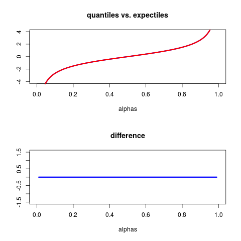

[](http://quantlet.de/index.php?p=info)

## [](http://quantlet.de/) **TERES_ExpectileQuantileDiff** [](http://quantlet.de/d3/ia)

```yaml

Name of QuantLet : TERES_ExpectileQuantileDiff

Published in : Tail Event Risk Expected Shortfall

Description : 'Calculates the expectile value which is equal to the quantile for all risk levels
under a special distribution and compares the expectile vs. quantile in plots.'

Keywords : expectile, heavy-tailed, quantile, risk, risk management, risk measure, tail

See also : 'MSEconfexpectile0.95, SFSconfexpectile0.95, SFSconfexpectile0.95,
TERES_ExpectileQuantileDiffMulti'

Author : Philipp Gschöpf, Andrija Mihoci

Submitted : Tue, August 2 2016 by Roman Lykhnenko

```




### R Code:
```r

# clear variables and close windows
rm(list = ls(all = TRUE))
graphics.off()

# Load required packages
libraries = c("numDeriv")
lapply(libraries, function(x) if (!(x %in% installed.packages())) {
  install.packages(x)
})
lapply(libraries, library, quietly = TRUE, character.only = TRUE)

# The distribution such that the expectile equals the quantile
Fdist = function(x) {
  if (x < 0) {
    0.5 * (1 - (1 - 4/(4 + x^2))^0.5)
  } else {
    0.5 * (1 + (1 - 4/(4 + x^2))^0.5)
  }
}

F = function(x) {
  sapply(x, Fdist)
}
f = function(x) {
  grad(F, x)
}

tauexact = function(alpha) {
  inverse = function(f, lower = -100, upper = 100) {
    function(y) uniroot((function(x) f(x) - y), lower = lower, upper = upper)[1]
  }
  quantileFun = inverse(F)
  q = as.numeric(quantileFun(alpha))
  LPM = function(x) {
    x * (f(x))
  }
  LPMq = function(x) {
    integrate(LPM, -Inf, x)
  }
  tmp = as.numeric(LPMq(q)[1]) - q * alpha
  tmp/(2 * tmp + q)
}

q_func = function(alpha, delta = 1) {
  inverse = function(f, lower = -100, upper = 100) {
    function(y) uniroot((function(x) f(x) - y), lower = lower, upper = upper)[1]
  }
  quantileFun = inverse(F)
  q = as.numeric(quantileFun(alpha))
  q
}

PartialMoment = function(x) {
  LPM = function(y) {
    y * (f(y))
  }
  as.numeric(integrate(LPM, -Inf, x)[1])[1]
}

G = function(x) {
  (PartialMoment(x) - x * F(x))/(2 * (PartialMoment(x) - x * F(x)) + (x))
}

g = function(x) {
  grad(G, x)
}

e = function(alpha) {
  inverse = function(g, lower = -100, upper = 100) {
    function(y) uniroot((function(x) g(x) - y), lower = lower, upper = upper)[1]
  }
  quantileFun = inverse(G)
  q = as.numeric(quantileFun(alpha))
  q
}

alphas = seq(0.01, 0.99, 0.01)
quant  = c(sapply(alphas, q_func))
expect = c(sapply(alphas, e))
diff   = (quant - expect)

par(mfrow=c(2,1))
plot(alphas, quant, type = "l", col = "blue", lwd = 3, ylab="", main = "quantiles vs. expectiles", xlim=c(0, 1), ylim=c(-4, 4) )
points(alphas, expect, type = "l", col = "red", ylab="", lwd = 3)
plot(alphas, diff, type = "l", col = "blue", lwd = 3,  ylab="", main = "difference", xlim=c(0, 1), ylim=c(-1.5, 1.5))

```
