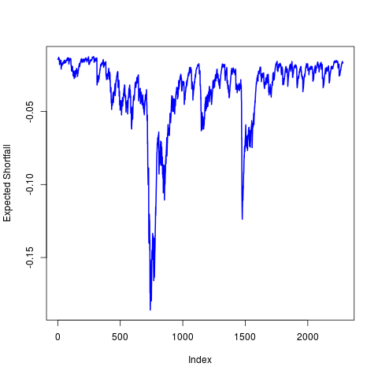

[](http://quantlet.de/index.php?p=info)

## [](http://quantlet.de/) **TERES_RollingWindow** [](http://quantlet.de/d3/ia)

```yaml

Name of QuantLet : TERES_RollingWindow

Published in : Tail Event Risk Expected Shortfall

Description : 'Estimates the expected shortfall of a sample y using expectiles. The estimation
requires an expectile level such that it is equal to the value at risk with the predetermined risk
level. This is obtained from a normal Laplace mixture. Estimation is executed using moving windows
of subsamples.'

Keywords : 'expected shortfall, expectile, financial, heavy-tailed, risk, risk management, risk
measure, tail'

See also : 'MSEconfexpectile0.95, SFSconfexpectile0.95, SFSconfexpectile0.95,
TERES_ExpectileQuantileDiffMulti'

Author : Philipp Gschöpf, Andrija Mihoci, Lukas Borke

Submitted : Tue, August 2 2016 by Roman Lykhnenko

```




### R Code:
```r

# Load required packages
library("VGAM")
library("BMS")
library("expectreg")
library("fGarch")
library("numDeriv")
library("rootSolve")

#Uncomment to change your working directory
#setwd()

RiskLevel		= 0.01  #Predetermined Value at Risk level
Contamination	= 0  #between  0 and 1, 0 = Normal, 1 = Laplace
windowsize		= 250  #Estimation window size for the rolling window

Stock = read.csv('DataIndices.csv')
y = Stock[,4]
y = diff(log(y))
y = na.omit(y)

# pre-white data with a GARCH model
GARCHvola	= garchFit(~garch(1, 1), data = y)
ywhite		= y / volatility(GARCHvola)
yclean		= ywhite - mean(ywhite)

tau = function(alpha, delta = 0) {
  if (alpha < 1e-27) {
    return(0)
  }
  F = function(x) {
    (1 - delta) * pnorm(x) + delta * plaplace(x)
  }
  f = function(x) {
    grad(F, x)
  }
  inverse = function(f, lower = -100, upper = 100) {
    function(y) uniroot((function(x) f(x) - y), lower = lower, upper = upper)[1]
  }
  quantileFun = inverse(F)
  q = as.numeric(quantileFun(alpha))
  LPM = function(x) {
    x * (f(x))
  }
  LPMq = function(x) {
    integrate(LPM, -Inf, x)
  }
  tmp = as.numeric(LPMq(q)[1]) - q * alpha
  return(tmp / (2 * tmp + q))
}

ES = function(delta, alpha, sample) {
  funtau = sapply(alpha, tau, delta)
  etau = quantile(sample, alpha)
  return(etau + (etau - mean(sample))/(1 - 2 * funtau) * (funtau/alpha))
}

# Estimation, this can take up to a minute
ESresults = vector(length = (length(y) - windowsize + 1))
for (i in (1:(length(y) - windowsize + 1))) {
  ywindow = yclean[(i):(i + 249)]
  ESresults[i] = ES(Contamination, RiskLevel, ywindow) * volatility(GARCHvola)[i + 
    windowsize - 1]
}

plot(ESresults,ylab = "Expected Shortfall", type = "l", lwd=2, col = "blue")

# uncomment to save the results
# write.table(ESresults, file = "ESfromRollingWindow.csv", sep = ",")
# write.table(yclean, file = "StandardizedReturns.csv", sep = ",")

```
